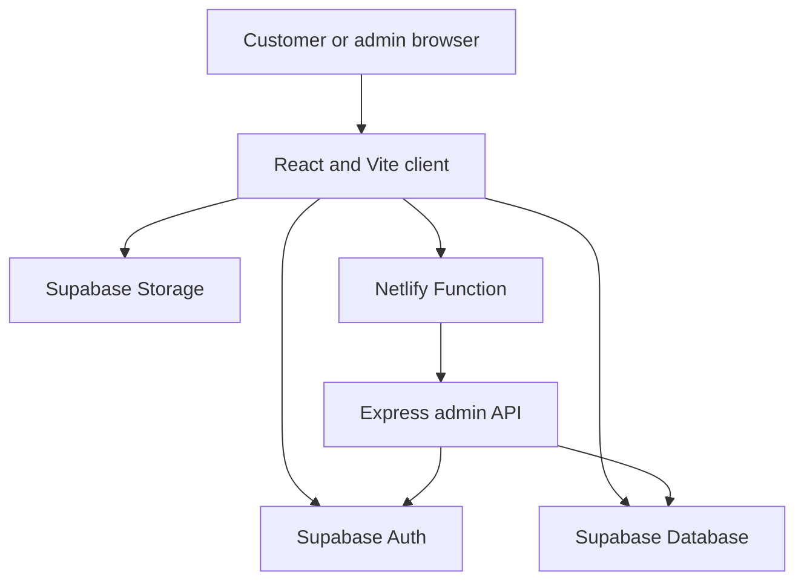

# ss.collection

A full-stack menswear catalogue for **ss.collection**, built for browsing modern T-shirts and shorts and turning product interest into WhatsApp enquiries. The project includes a responsive storefront, Supabase authentication, a protected catalogue dashboard, image management, and one-click Netlify deployment.

[](https://sscollection-s.netlify.app/)
[](https://react.dev/)
[](https://vite.dev/)
[](https://supabase.com/)

## Live demo

- Storefront: [https://sscollection-s.netlify.app/](https://sscollection-s.netlify.app/)
- Admin route: [https://sscollection-s.netlify.app/admin](https://sscollection-s.netlify.app/admin)
- API health: [https://sscollection-s.netlify.app/health](https://sscollection-s.netlify.app/health)

The admin route requires a confirmed Supabase user whose `app_metadata.role` is `admin`.

## Features

### Storefront

- Responsive catalogue for mobile, tablet, and desktop
- Product search by name, description, and category
- Category and price-range filters
- Newest, price, and alphabetical sorting
- Product-detail drawer with multiple images
- Size, colour, and quantity selection
- Prefilled WhatsApp enquiry link
- Email/password signup, login, persistent sessions, and logout

### Admin catalogue

- JWT-protected admin route and API
- Create categories
- Create unpublished product drafts
- Upload and replace JPG, PNG, and WebP product images
- Publish and unpublish products
- Browse products as visual cards
- Edit product information from a product-specific drawer
- Permanently delete products and clean up their stored images

### Security

- PostgreSQL Row Level Security on catalogue tables
- Public users can read only published products
- Admin authorization uses Supabase `app_metadata`
- Storage writes are restricted to authenticated admins
- Product images are limited to 2 MB and approved MIME types
- The frontend and server use a Supabase publishable key; no service-role key is required

## Tech stack

| Layer | Technology |
| --- | --- |
| Frontend | React 19, Vite 8, React Router |
| Styling | Tailwind CSS 4 |
| Backend | Node.js, Express 5 |
| Database | Supabase Postgres |
| Authentication | Supabase Auth |
| Image storage | Supabase Storage |
| Serverless adapter | `serverless-http` |
| Hosting | Netlify and Netlify Functions |
| Code quality | Oxlint |

## Architecture



The public catalogue reads published data directly from Supabase under RLS. Admin product creation uses the Express API, which validates the Supabase access token and admin claim. Other protected catalogue and storage operations remain governed by Supabase RLS policies.

## Project structure

```text
sscollection/
├── client/                     # React storefront and admin interface
│   ├── public/
│   ├── scripts/
│   ├── src/
│   │   ├── lib/                # Supabase client and admin API helpers
│   │   ├── App.jsx             # Storefront shell
│   │   ├── ProductGrid.jsx     # Search, filters, sorting, product cards
│   │   ├── ProductDrawer.jsx   # Product details and WhatsApp CTA
│   │   ├── AdminPage.jsx       # Admin dashboard
│   │   ├── ProductDraftForm.jsx
│   │   ├── ProductImages.jsx
│   │   ├── ProductPublishing.jsx
│   │   └── ProductEditor.jsx
│   └── package.json
├── database/
│   ├── catalogue-setup.sql     # Tables, indexes, grants, RLS, seed categories
│   ├── image-storage-setup.sql # Storage bucket and policies
│   └── bootstrap-admin.sql     # Assigns the first admin role
├── server/
│   ├── netlify/functions/api.js
│   ├── src/
│   │   ├── admin.js            # Protected admin API routes
│   │   ├── app.js              # Express application
│   │   ├── index.js            # Local server entry point
│   │   └── supabase.js         # Request-scoped Supabase clients
│   └── package.json
├── netlify.toml
└── README.md
```

## Local development

### Prerequisites

- Node.js 24 or a compatible modern Node.js release
- npm
- A Supabase project

### 1. Clone and install

```bash
git clone https://github.com/Sudip-C/sscollection.git
cd sscollection
npm --prefix client ci
npm --prefix server ci
```

### 2. Configure Supabase

Open the Supabase SQL Editor and run these files in order:

1. `database/catalogue-setup.sql`
2. `database/image-storage-setup.sql`

The catalogue script creates the `categories` and `products` tables, indexes, privileges, RLS policies, and starter categories. The storage script creates the public `product-images` bucket and admin-only write policy.

### 3. Configure environment variables

Create `client/.env.local`:

```dotenv
VITE_SUPABASE_URL=https://your-project-ref.supabase.co
VITE_SUPABASE_PUBLISHABLE_KEY=sb_publishable_your_key
VITE_WHATSAPP_NUMBER=919876543210
```

Use the WhatsApp number in international format without `+`, spaces, or punctuation.

Create `server/.env`:

```dotenv
SUPABASE_URL=https://your-project-ref.supabase.co
SUPABASE_PUBLISHABLE_KEY=sb_publishable_your_key
```

Environment files and `node_modules` are ignored by Git and must never be committed.

### 4. Start the applications

Run the API in one terminal:

```bash
cd server
npm run dev
```

Run the client in another terminal:

```bash
cd client
npm run dev
```

Local addresses:

- Frontend: `http://localhost:5173`
- Admin: `http://localhost:5173/admin`
- API health: `http://localhost:3001/health`

Vite proxies local `/api` requests to the Express server on port `3001`.

## Create an admin account

1. Create an account through the storefront and confirm its email address.
2. In Supabase, open **Authentication → Users** and copy the user's UUID.
3. Replace the user ID in `database/bootstrap-admin.sql` with that UUID.
4. Run the script in the Supabase SQL Editor.
5. Sign out and sign in again so the refreshed JWT contains the admin claim.

You can also promote a confirmed account by email:

```sql
update auth.users
set raw_app_meta_data =
  coalesce(raw_app_meta_data, '{}'::jsonb)
  || jsonb_build_object('role', 'admin')
where email = 'admin@example.com'
returning id, email, raw_app_meta_data ->> 'role' as app_role;
```

Authorization must use `raw_app_meta_data` / `app_metadata`. User metadata is editable by the account owner and must not be trusted for roles.

## Available scripts

### Client

```bash
npm --prefix client run dev       # Start Vite
npm --prefix client run lint      # Run Oxlint
npm --prefix client run build     # Create production build
npm --prefix client run preview   # Preview production build
```

### Server

```bash
npm --prefix server run dev       # Start API in watch mode
npm --prefix server start         # Start API normally
```

## API routes

| Method | Route | Access | Purpose |
| --- | --- | --- | --- |
| `GET` | `/health` | Public | API health check |
| `GET` | `/api/admin/me` | Admin | Validate the current admin token |
| `GET` | `/api/admin/categories` | Admin | List categories |
| `POST` | `/api/admin/categories` | Admin | Create a category |
| `POST` | `/api/admin/products` | Admin | Create an unpublished product draft |

Protected requests use a Supabase access token in the `Authorization: Bearer <token>` header.

## Quality checks

Before committing frontend changes, run:

```bash
npm --prefix client run lint
npm --prefix client run build
```

Verify the local API separately:

```powershell
Invoke-RestMethod http://localhost:3001/health
```

Expected response:

```text
status service
------ -------
ok     ss.collection API
```

## Deploy to Netlify

The repository includes `netlify.toml`, which:

- installs client and server dependencies;
- builds the Vite application;
- publishes `client/dist`;
- deploys Express as a Netlify Function;
- rewrites `/api/*` and `/health` to the function;
- sends client-side routes such as `/admin` to `index.html`.

Import the repository into Netlify with the base directory left blank. Add these environment variables in **Project configuration → Environment variables**:

```text
VITE_SUPABASE_URL
VITE_SUPABASE_PUBLISHABLE_KEY
VITE_WHATSAPP_NUMBER
SUPABASE_URL
SUPABASE_PUBLISHABLE_KEY
```

After deployment, configure Supabase Auth:

- Set **Authentication → URL Configuration → Site URL** to the production Netlify URL.
- Add `http://localhost:5173/**` as an additional redirect URL for local development.
- Add the production URL as an allowed redirect URL.

Each push to `main` triggers a new Netlify deployment.

## Product workflow

1. Create or select a category.
2. Save a product draft.
3. Upload one or more product images.
4. Review and edit product information.
5. Publish the product.
6. Customers open the product drawer and send a prepared WhatsApp enquiry.

## Author

Built by [Sudip Chowdhury](https://github.com/Sudip-C).

